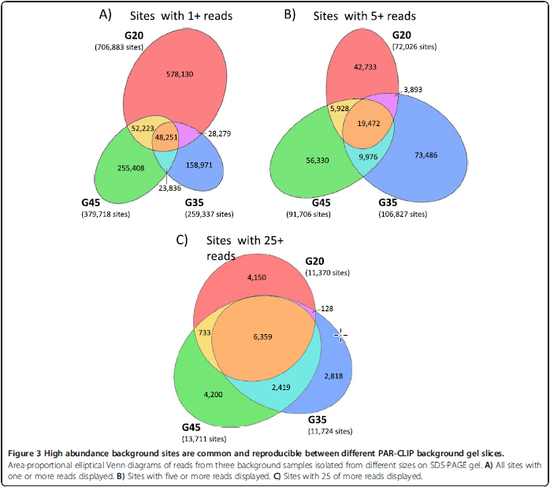
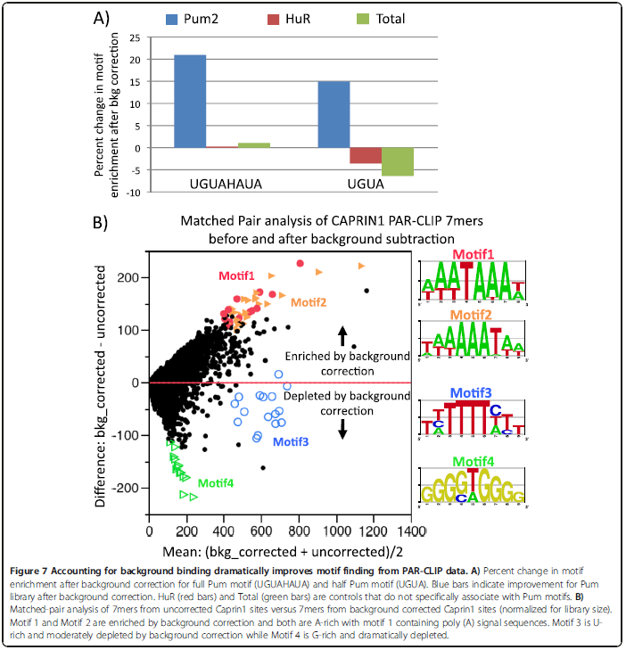

#PAR-CLIP

基于文献：Advancing the functional utility of PAR-CLIP by quantifying background binding to mRNAs and lncRNAs

## 我们是否可以做，难度有多大

**只涉及到生信相关方法**

### 涉及到的软件及方法

- bowtie：用以read的比对
- PARalyzer：识别结合位点
- PhyloGibbs：k-mer识别
- Background correction：bedtools

### 评估

如果实验安装文中所做的做出来，生信重复文中方法及结果并不难，可行性较高。

### 需求

因为本身PAR-CLIP是之前为接触的一个新的部分，所以要开战分析，需要有一定的背景知识，最好能有人分享一下实验原理及所做工作完成的意义，更便于生信同事理解及操作。

## PAR-CLIP

### 什么是PAR-CLIP

光活性增强的核糖核苷交联和免疫共沉淀

### 详细解释

正如我们所知，在真核生物体内，基因的转录调控在基因的表达中起到了十分重要的作用。在这一领域中，染色质免疫共沉淀-高通量测序（CHIP-seq，用来测定与DNA作用的反式作用因子蛋白）越来越受研究人员欢迎。同时，转录后的基因调控在基因表达中同样也起到了相当关键的作用， RNA结合蛋白（RBPs）和小RNA-核糖核蛋白复合物（miRNPs）对真核生物基因表达起到了很重要的作用，这些蛋白跟DNA结合蛋白一样，可以与相关的序列结合来指导它们的表达。这些RBPs和miRNPs共同来调控细胞内许多过程，包括mRNA的成熟、运输、修饰和翻译。因此，确定RBPs和miRNPs与它们目标转录本的相互作用在理解真核生物内转录调控的网络是很重要的。

RIP-Clip是一种主要用于分离和鉴定细胞中核糖核蛋白复合体中的mRNAs、microRNAs以及蛋白复合物的方法。这个方法可以确定某些RBP是否能与特定的RNA结合并讲RBPs与其结合的RNA免疫沉淀下来。然而，这个方法并没有给出足够的证据来表明特定的识别序列或者结合的基序。接下来，交联-免疫沉淀法（CLIP）在免疫以前被用来构成RNA-RBP复合物，弥补了RIP-RBP的一些缺点。上述的这两个方法，简单地说，介绍了一般的过程：结合RPBs或者miRNPs的RNAs被分离，然后逆转录，以及做cDNA的测序。但是，CLIP是有局限的，由于UV交联的低效率，这是因为非交联的RNA分子更加容易被逆转录，结果导致高的噪声比和很难分辨出交联与非交联的靶RNAs。目前，一个被改良的技术，结合高通量的测序，被由研究人员建立起来了，那就是PAR-CLIP。

在活体细胞中，紫外光可以将RNA与RNA结合蛋白共价结合起来。在PAR-CLIP方法中，活体细胞被暴露在紫外灯下，使得RNA-蛋白结合起来并且可以用免疫共沉淀的方法使特异性的蛋白以及与其结合RNA一同被分离出来。这个方法中最重要的一点就是方依赖了具有光活性的核糖核苷类似物，例如4-硫尿核苷，在活体细胞中将其插入到新生RNA转录本中。在356nm紫外灯辐射的细胞中，光活性的核糖核标记的RNA被诱导与RBP相互作用。免疫共沉淀所要的RBP，然后分离被交联和共沉淀的RNA。RNA随即被转换成cDNA文库并且使用Solexa技术进行深入测序。通过PAR-CLIP所准备的cDNA文库具有的一个特点就是能够准确的定位交联的位置，而这是依靠cDNA序列的突变位置。当使用4-硫尿核苷时，交联的序列将会产生T-C的转变。这种在被测序的cDNA序列中的转变提供了一个巧妙的解决准确绘制RNA结合蛋白的结合位点方法，从而从噪声中获得了真实的交联的RNA序列。

## 文章研究方法

### 缩写

`IP：免疫提纯（immuno-purification）`

### 目的

因为PAR-CLIP方法会导致一些非特异性的RNA也被提取出来（基于共价键），所以文章探究了PAR-CLIP背景的重要性，并且基于背景校正之后，可以得到一些之前没有获得的一些新的结果。

### 实验设计

**其中包含了自己的理解，有些可能有些错误。主要还是方法本身不是特别熟悉。**

因为整个的实验方法类似于CHIP-Seq，所以设计了一个case及一个control，case就是是用`HuR`作为免疫沉淀蛋白的，control则是使用`lysates`作为免疫沉淀蛋白。已知`HuR`有一些目标RNA区域，而`lysates`则没有，认为他不会有任何的处理。

经过同样的PAR-CLIP protocol处理，再经过反转录等的一些实验步骤，进行上机测序，最终的到实验数据。

经过处理之后呢，会有一个类似于跑胶的过程。结果如下：

 

左边第一幅是HuR阳性的跑出的结果，其中有一条很明显带。第二条是经过FLAG-tag处理的（猜测是`lysates`）结过很明显没有HuR阳性所表示的那个颜色的带。而在阳性结果里，还可以看到几条分离的带，在FLAG-tag中也能看到。然后第三幅则是未经过FLAG-tag处理的（猜测也是`lysates`），同样能够看到分离的带。说明分离的结果不是由于FLAG-tag处理所导致。可能就是原始结果中包含。

然后实验者将FLAG-tag的样本分为3组取下来进行后续的实验，同HuR的进行比较。

### T到C转换的结果

因为使用PAR-CLIP实验方法有一个很明显的特异性，就是这种方法可以使得真正和蛋白作用的RNA序列发生突变，也就是从T->C的变异，所以为了验证，HuR的阳性结果中，是否都是包含这样变异的，以及在control中是否也包含这样的变异进行了统计（*如果HuR中阳性结果全是真实，那么都应该含有T->C的变异，而control中因为都不存在这样的免疫沉淀应该都
不含有T->C这样的变异，当然这是理想情况下*）。结果如下：

 

A图表示HuR阳性结果\control45\control35\control20中的统计比例，发现其实阳性结果中与control中其实有很多都是包含T->C变异的，这个并不能说明什么问题。

### G-rich

为了确定，background的reads是来自于细胞本身，还是由于实验的原因导致。（*其中有一个totoal RNA的获得方式没有太看明白*）。实验本身就是为了比较用PAR-CLIP处理过得和totoal RNA的在mapping到基因组上的时候，有没有很大的差异。结果如上图B。

**发现Background和total在RNA组分上差异不大**

使用`k-mer`分析组分，得到上图C图，几乎都是G富集的。

### 高丰度，高一致性

下图直接说明结果：

 

当位点至少1条read覆盖的时候，三个control的一致性很小，但是当要求越来越高，需要达到25+reads覆盖，三个control的重合度越来越大。也就是其实对于一些重合区域，主要是丰度很高的那些区域。丰度低的区域可能是随机导致。

### 假阳性位点

#### 我们实验的结果

文中主要研究了三个位点，`MALAT1`的non-conding，coding，及`ELAVL1`的3\`端

 

从这三个位点可以看出有一些点（前两个）在HuR中虽说有较高峰度，但是在control中也是有的，只有最后一种情况，在control中不存在，而是HuR特有的。所以能够得到结论是真阳性位点。而且这个点也是明确的HuR会结合的RNA区域。

#### 整合前人的结果

文中一个特别显著的例子就是上图中的A图，`XIST`基因。红线表示三个control中能找到reads覆盖的区域，蓝色的就是其他人的实验找到的该区域的read，发现几乎都差不多，而且几乎均有覆盖，这就不能说明这个基因是某个沉淀蛋白共同作用的了。

而B图，展示的是实验中，有多少位点是与control重合的。其中红色代表这个实验的RBP是新的，正在用实验验证，而蓝色的则是表示这个RBP是已知的。

这其实也就说明，前人的实验中，其实有很多结果都不算是特别真实的。有很大一部分假阳性在里面。

### 背景校正

>To correct for background binding, we eliminated sites from Pum2 PAR-CLIP that overlapped by one or more nucleotides with sites from at least one of the three PAR-CLIP background samples.

A:矫正后的特异性增加；B:矫正后，可以找到CAPRIN1的motif了

